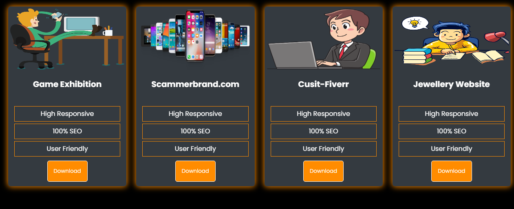

# Digital Portfolio
A digital portfolio is like an online scrapbook that showcases your skills in action, your experience, and your expertise through real-life examples. By looking at this scrapbook, your future employer or client can get a feel of what you bring to the table and who you are as a professional.

## Responsive Navigation Bar

## Profile Pic, Skills And Experiences Section

## Projects Section

## Event Section

## Contact Section

## Technologies

- HTML5
- CSS3
- Javascript

## Authors

- [Liaqat Ali Full Stack Web & Software Engineer](https://github.com/liaqatali-web3)

